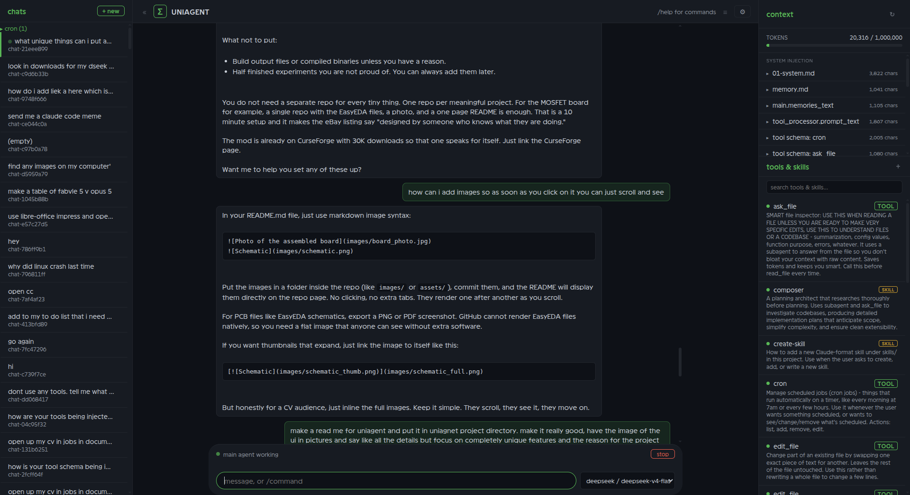

# Uniagent

An AI agent framework in Python. It gives an LLM tools to read and write files, run terminal commands, search the web, send emails, manage scheduled jobs, and more. You can use it from a browser on any device on your network, or from the terminal.



## Features

### Tool system

Every tool is a standalone `.py` file in `tools/`. The loader (`scripts/tool_processor.py`) scans the folder on startup, imports each file, and checks it has four things:

- `NAME` -- identifier
- `DESCRIPTION` -- what it does
- `INSTRUCTIONS` -- how to call it
- `run(**kwargs)` -- the function

No config, no registration, no schema files. Broken tools are logged in a `BROKEN` list while the rest still load. The agent can create its own tools at runtime by writing new `.py` files into `tools/`, which are loaded immediately.

Built-in tools include: read/write files, run terminal commands, search/fetch the web, send and manage email, take screenshots, add scheduled jobs, read skills, launch subagents, and inspect images.

### Web UI vs CLI

Uniagent has both a web interface and a CLI (`uniagentcli`, from `scripts/cli.py`).

The **web UI** is the main way to use it. It has a three-panel layout:

- **Left sidebar** -- chat list with history management
- **Center** -- conversation with streaming messages and a real-time token counter
- **Right panel** -- context files in collapsible sections, tool list with status indicators and search, pinned tools/skills
- **Settings** -- 9 tabs: Models, Providers, Email, Appearance, Voice, Context, Cron, Safety, System
- **Subagent status** -- shows how many subagents are currently working
- **Model switcher** -- change provider or model mid-conversation

The **CLI** is a terminal-based interface with markdown rendering and keyboard shortcuts. It is lighter and faster for quick interactions or scripting, but the web UI offers more information at a glance and a more streamlined experience for regular use.

### Voice control from any device

The web frontend has a hold-to-talk microphone button. Press it, speak, release. Audio is recorded in the browser using the Web Audio API and sent to the server's `POST /voice` endpoint, which transcribes it and returns the text, which then enters the chat as if you typed it.

Transcription goes through the same providers chat does. The voice tab picks one of them and a speech model on it -- Whisper or gpt-4o-transcribe at OpenAI, whatever a local server is serving, or a Gemini model handed the audio directly -- and that choice is global: the browser button, the desktop hold-to-talk key and the terminal all use it. With nothing chosen it falls back to Whisper on `OPENAI_API_KEY`.

The server binds to `0.0.0.0`, so the page is accessible from any device on the local network (phone, tablet, another laptop). It serves over HTTPS on port 8764 using a self-signed certificate it generates itself, which is what lets browsers hand the page a microphone. Accept the certificate warning once per device and the mic works.

On desktop, there is also a local voice path: hold Scroll Lock, speak, release. PyAudio records from the default microphone without needing the browser.

### Scheduled jobs (cron)

The cron system (`scripts/cron.py`) runs as a separate watcher process. It reads `cron.json` every 30 seconds and fires jobs when they are due.

A schedule is two unix timestamps in seconds, and nothing else: `start` is the moment of the first run, `interval` is the gap between runs. Runs land on `start`, `start + interval`, `start + 2 x interval`, and so on. Leave `interval` out (or set it to 0) for a job that happens once and never again. A job is a JSON object in the file's `jobs` list:

```json
{
  "name": "ai-brief",
  "start": 1785567600,
  "interval": 86400,
  "provider": "deepseek",
  "model": "deepseek-v4-flash",
  "safety": true,
  "prompt": "Write me a briefing and save it to ..."
}
```

The settings page's **cron** tab lists the jobs as rows, one per job, each showing its name and when it next runs. A row folds open (they all start shut) into the job's settings: the schedule as a date picker and a repeat box, the provider, model, temperature and safety, and the prompt itself. The file itself is still editable directly at the bottom of that tab, for the fields the form does not cover. `date -d @1785567600` reads a timestamp back in local time, and `date -d "tomorrow 07:00" +%s` writes one. The `cron` tool the agent uses will also take `"07:00"`, `"now"` or `"6h"` and convert them, so asking for something daily at 7am does not need any arithmetic. Two things follow from the timing being plain seconds: a schedule that has already gone past is never caught up (a daily job written at 9am first fires at its time tomorrow), and an interval is a fixed number of seconds, so a daily job lands an hour out after the clocks change until its `start` is nudged back.

Each cron job gets its own **cron chat** -- a persistent conversation at `chats/cron/<name>/` that records every run, every tool call, and every result. These chats appear in the web UI sidebar alongside normal chats, so you can open them and see exactly what the job did. They are created from the moment the job is written to `cron.json`, not just when it first fires, so you can see a job exists before it has ever run.

Cron jobs run through the same tool loop and safety checks as regular chat. Each job can specify its own provider, model, temperature, and safety settings in `cron.json`.

### Safety system

Every tool call from the model is validated before it runs. A separate, smaller LLM checks the call against a configurable safety prompt. The check is layered:

1. **Whitelist** -- trusted tools like `screenshot_tool` skip the check entirely
2. **Blacklist** -- scans for core system paths and flags anything dangerous
3. **LLM verification** -- everything else is sent to a verification model that rates the danger level (0-10) and either approves or flags it
4. **User approval** -- flagged calls pause and ask you to approve or deny before running

The safety prompt, verification model, and verification provider are all configurable from the Settings page. You can also disable safety checks entirely.

**Cron jobs and safety:** when a cron job runs, its tool calls go through the same validation, but flagged calls are denied outright instead of asking a human to approve them (there is no human present). This means unattended jobs fail safe -- if something looks risky, it does not run. Each cron job can set its own `safety_prompt` and toggle safety on or off independently.

### Model support

Swap between Anthropic (Claude), OpenAI (GPT), DeepSeek, and Google (Gemini) from the settings panel or the quick selector. Each chat remembers its own provider, model, and temperature. Subagents and cron jobs can use different models too, set per-job in `cron.json`.

### Subagents

Uniagent supports background subagents. These are separate agents with their own full tool access that work in parallel while the main conversation continues. Each subagent has its own chat history and can be assigned a different provider or model. The web UI shows how many subagents are currently working.

## Project structure

```
Uniagent/
├── context/          System prompts, safety rules, memory, skill index
├── scripts/          Core loop (main.py), web server (server.py), CLI (cli.py),
│                     cron watcher (cron.py), tool loader, voice input,
│                     settings, compaction, tool validation
├── tools/            One .py file per tool -- drop a file, it is a tool
├── skills/           Knowledge files loaded on demand (not callable tools, just read)
├── memories/         Topic-specific files indexed but not auto-injected
├── chats/            Per-chat JSON history and settings, including cron/ subfolder
├── web/              HTML/CSS/JS frontend (single-page app)
└── images/           Screenshots and assets
```

## Getting started

```bash
git clone https://github.com/JJM8/Uniagent.git
cd Uniagent
cp .env.example .env
# Add your API keys
python3 scripts/server.py
```

On first run the server generates a password and prints it. Open https://localhost:8764 in a browser, or https://your-machine-ip:8764 from any device on your network, and enter it. The password lives in `.env` as `UNIAGENT_PASSWORD`; change it there and restart to log every device out.

Your browser will warn about the certificate the first time on each device, because Uniagent signs its own. Click Advanced, then proceed. Port 8763 only redirects to 8764 — the app itself is HTTPS-only, since the password would otherwise cross the network in plain text.

### CLI mode

```bash
python3 scripts/cli.py
```

To get it as a command from anywhere, link the launcher onto your PATH:

```bash
ln -sf "$PWD/scripts/uniagentcli" ~/.local/bin/uniagentcli
```

Then `uniagentcli` opens a chat, and `uniagentcli "some question"` runs a single turn and exits. It reads the terminal's colours from the same theme the web UI uses; set `UNIAGENT_THEME=light` if your terminal has a light background.

The prompt stays live while the agent works, and what you press decides when your message lands:

| Key | While a reply is running |
|:----|:-------------------------|
| `enter` | fold it into the turn already running, as soon as the tool in flight comes back |
| `tab` | hold it until the reply is completely finished, then send it as its own turn |
| `esc` | stop the running turn, same as `/stop` |
| `/command` | runs immediately, queued behind nothing |

Queued messages are listed above the prompt until they go. On an idle prompt `enter` and `tab` both just send, and `tab` completes a half-typed `/command`.

A status bar sits under the prompt the whole time, showing the chat's model and how full its context is (`deepseek/deepseek-v4-flash ███░░░░ 12.4k/128k 10%`), the same two numbers the web UI keeps on screen. It is recounted in the background after every turn, never on the keystroke path, and a `~` marks a count the model's own tokenizer could not do exactly.

Bare `/chats` and `/model` open a list you arrow through instead of printing one: `↑↓` to move, typing filters, `enter` selects, `esc` cancels. Give either an argument (`/model openai gpt-5.2`) and it behaves as the plain command. Loading a chat replays its transcript so you can see what is in it, capped at the last 30 turns with `/history` for the raw thing.

### Cron watcher (for scheduled jobs)

```bash
python3 scripts/cron.py
```

Or run it as a systemd service (service files included in `scripts/`).

## Requirements

- Python 3.10+
- API keys for whatever models you want to use (set in `.env`)
- Ports 8763 and 8764 available
